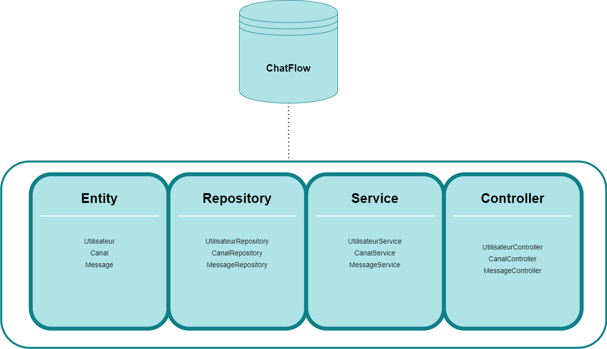

<h1 align="center">ChatFlow</h1>

  
   
  <i>ChatFlow est un application de chat  
     développée par :</i> 
     Imen AMMAR </i>
     Iqra TARIQ </i>
     Jawher BEN AMMOR</i>
   

## Documentation

### Prérequis

#### JDK
Il faut installer au moins [la version 17 du JDK]

#### Eclipse
Il faut installer [Eclipse for Enterprise Java and Web Developers] avec Spring depuis le marketplace ou bien [Spring Tool Suite]

#### PostegreSQL
Il faut installer [PostegreSQL]

#### Postman
Il faut installer [Postman]

### Architecture

  

### Avant de lancer l'application

Il faut impérativement éxécuter le script SQL <b>ressources\create_db_user.sql</b> qui permet de créer l'utilisateur et la base de données.

[la version 17 du JDK]: https://www.oracle.com/java/technologies/downloads/#java17
[Spring Tool Suite]: https://spring.io/tools
[Eclipse for Enterprise Java and Web Developers]: https://www.eclipse.org/downloads/packages/
[Postman]: https://www.postman.com/
[PostegreSQL]: https://www.postgresql.org/download/