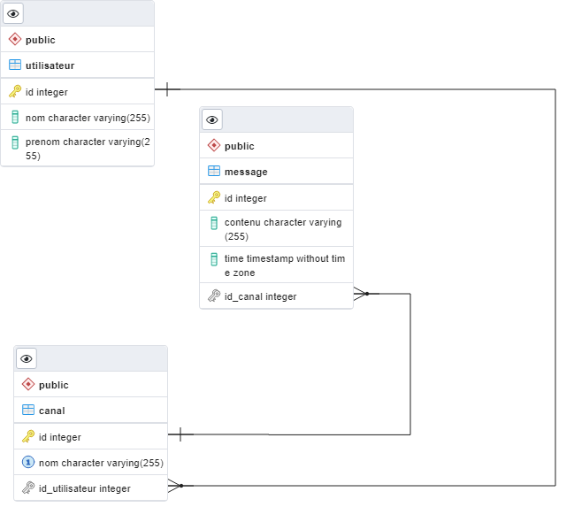

<h1 align="center">Documentation</h1>

Ce document permet d'expliquer l'architecture de la partie Back End
# Architecture

  

## Entités
>Le package "entity" permet de regrouper les différents entités Java.  
Les classes utilisent les annotations JPA (@Entity, @Id, @column,...). 
Chaque identifiant d'une entité est géré par une séquence.

  

## Repository
>Le package "repository" permet de regrouper les différents interfaces qui etendent l'interface **JpaRepository.** On a utiliser cette interface parcequ'elle fournit par défaut les méthodes CRUD pour une entité.  
Pour étendre l'interface, il faut spécifier le nom de l'entité ainsi que le type de l'identifiant de cette entité. 
Vous pouvez aussi spécifier des méthodes avec des requêtes JPQL.

  

## Services
>Le package "service" permet de regrouper les différents classes de service. 
Chaque classe est annoter par l'annotation **@Service** 
Pour chaque classe, on injecte la dépendance vers le reposiory via l'annotation **@Autowired** 

  

## Contrôleurs
>Le package "controller" permet de regrouper les différents classes qui exposent les web services REST. 
Chaque classe est annoter par les annotations **@RestController** et **@RequestMapping** 
Pour chaque classe, on injecte la dépendance vers le service via l'annotation **@Autowired** 

  

## Schéma de la BDD
>Voici le schéma de la BDD généré via pgAdmin

  

